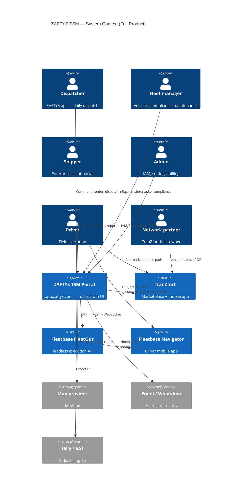

# System Context (C4 Level 1)

| Field | Value |
|-------|-------|
| **Parent** | [app-overview.md](../app-overview.md) |
| **Build strategy** | [build-strategy.md](./build-strategy.md) |
| **Feature map** | [sitemap-tsm.md](../sitemap-tsm.md) |

---

## Diagram

---

## Actors

| Actor | Primary surface | TSM modules |
|-------|-----------------|-------------|
| Dispatcher | TSM portal | Command Center, Shipments, Dispatch, Map |
| Fleet manager | TSM portal | Fleet, Maintenance, Documents, Compliance |
| Shipper | TSM portal (scoped) + `/track/[token]` | Shipments (read), Documents, Reports |
| Admin | TSM portal | Settings, IAM, Integrations, Billing |
| Driver | Navigator app or TranZfort mobile | Not TSM UI — feeds GPS/ePOD to Fleetbase |
| Network partner | TranZfort app | Assignments visible in TSM `/network` |

---

## External systems

| System | Purpose | TSM integration |
|--------|---------|-----------------|
| **Fleetbase FleetOps** | Orders, drivers, vehicles, GPS, ePOD, maintenance, telematics | BFF proxy — all Operations + Resources modules |
| **Fleetbase IAM** | Users, roles, policies, groups | `/settings/users|roles|policies` |
| **Fleetbase Developers** | API keys, webhooks, logs, sockets | `/integrations/*` |
| **Fleetbase Ledger** | Invoices, accounts | `/billing/*` |
| **TranZfort (Supabase)** | Marketplace bookings, partners | Sync worker + `/network/*` |
| **Mapbox** | Maps, geocoding | Client tiles + BFF geocode |
| **Traccar** (optional) | Hardware GPS | `/integrations/traccar` |
| **Valhalla / VROOM** | Routing, orchestrator | Internal Docker extensions |
| **Tally / GST APIs** | India compliance | `/integrations/tally`, `/billing/gst` |

---

## Trust boundaries

| Boundary | Rule |
|----------|------|
| Browser → Fleetbase | **Never** — all calls via BFF |
| Public track | HMAC token only; no session |
| TranZfort sync | Service credentials; not user JWT |
| Fleetbase console `:4200` | Internal VPN/dev only |
| API keys | Server env only; admin UI for rotation |

---

## Full product scope reference

~151 Fleetbase UI capabilities mapped to TSM routes. See [sitemap-tsm.md](../sitemap-tsm.md) Fleetbase audit + crosswalk.

**Skipped externally:** Storefront, extensions marketplace, Fleetbase Ember console.

---

## Document history

| Date | Change |
|------|--------|
| Jul 2026 | Initial context diagram |
| 11 Jul 2026 | Full product scope, 10 extensions, all actors |
