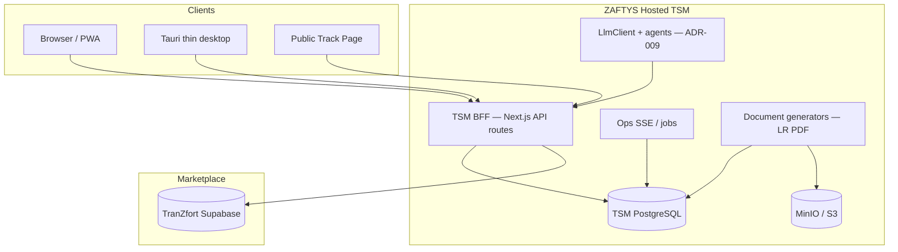

# System Design (C4 Level 2)

| Field | Value |
|-------|-------|
| **Parent** | [system-context.md](./system-context.md) |
| **Build strategy** | [build-strategy.md](./build-strategy.md) |
| **Execution SoT** | [ADR-008](../decisions/008-tsm-owns-execution.md) — TSM Postgres (Fleetbase transitional only) |

---

## Containers (target — post ADR-008)

**Transitional (Phases A–C):** BFF may still call Fleetbase via `FleetbaseExecutionStore`. **Phase D:** remove that path entirely.

---

## Container responsibilities

| Container | Tech | Responsibility |
|-----------|------|----------------|
| **Portal / desktop WebView** | Next.js 16 + Tauri shell | Full product UI; desktop loads hosted HTTPS only |
| **BFF** | Next.js Route Handlers | Auth, seats, RBAC, TranZfort bridge, `ExecutionStore` |
| **TSM Postgres** | Compose / managed | Portal + **execution** SoT (shipments, fleet, clients, positions) |
| **MinIO / S3** | Object storage | LR / ePOD / invoice blobs |
| **Document / AI services** | In-process BFF (v1) | PDF generate; `LlmClient` Google + OpenRouter |
| **TranZfort** | Supabase | Marketplace SoT: loads, bookings, trips, KYC Auth |

---

## Frontend module map (portal)

| Portal module | Primary routes | Backend |
|---------------|----------------|---------|
| Operations | `/`, `/shipments`, `/dispatch`, `/map` | TSM Postgres (`ExecutionStore`) |
| Resources | `/fleet`, `/clients`, `/vendors` | TSM Postgres + app stores |
| Marketplace | `/network/*` | TranZfort + BFF |
| Documents | `/documents` | TSM docs + MinIO (ADR-009) |
| Maintenance | `/maintenance/*` | TSM app stores / Postgres |
| Reports | `/reports/*` | BFF aggregates |
| Billing | `/billing/*` | TSM billing + later GST |
| Settings | `/settings/*` | TSM IAM/seats + org + AI BYOK |
| Integrations | `/integrations/*` | Webhooks / telematics (build depth later) |

---

## Data flow (read path — target)

1. Portal `GET /api/shipments` → BFF  
2. BFF validates session + `tsmOrgId` scope  
3. BFF reads org-scoped rows via `PostgresExecutionStore`  
4. BFF enriches: LR number, origin badge (fleet/network), client name  
5. JSON returned to UI / agent tools  

---

## Data flow (TranZfort)

1. Marketplace desks read/write via bridge RPCs (`service_*`) — unchanged  
2. Optional: “Create TSM job from trip” writes **TSM shipment** (not Fleetbase order)  
3. Legacy `run-tranzfort-sync` (TZ → FB) is **retargeted or removed** in ADR-008 Phase C  

---

## Data flow (live updates)

1. Positions land in `tsm_positions` (driver app / telematics / manual — depth over time)  
2. BFF ops stream / SSE notifies portal rooms `org:{id}`, `shipment:{id}`  
3. Map and track pages update; stale GPS → exception honesty  

---

## Deployment units

| Unit | Host | Notes |
|------|------|-------|
| Portal + BFF | Staging/prod VPS or PaaS | Horizon 2 |
| TSM Postgres | Managed or Compose | Single app DB |
| MinIO / S3 | Same region | Documents |
| Desktop installer | Customer PC | WebView → hosted URL only |
| TranZfort | Existing Supabase | No change |
| Fleetbase Docker | **Remove after Phase D** | Transitional only |

See [ops/deployment.md](../ops/deployment.md) and [ADR-008](../decisions/008-tsm-owns-execution.md).

---

## Document history

| Date | Change |
|------|--------|
| Jul 2026 | Initial container diagram |
| 11 Jul 2026 | Full module map, sync flow, 8-container Fleetbase |
| 2 Aug 2026 | Target architecture: TSM Postgres execution (ADR-008); thin desktop |
