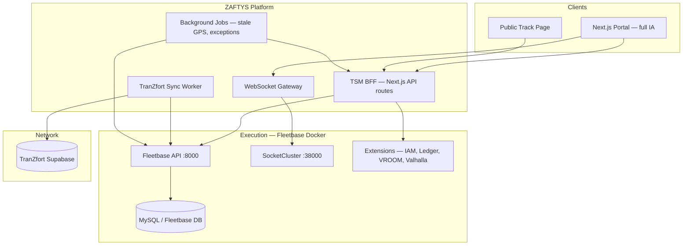

# System Design (C4 Level 2)

| Field | Value |
|-------|-------|
| **Parent** | [system-context.md](./system-context.md) |
| **Build strategy** | [build-strategy.md](./build-strategy.md) |

---

## Containers

---

## Container responsibilities

| Container | Tech | Responsibility |
|-----------|------|----------------|
| **Portal** | Next.js 16 App Router, React 19 | **Full product UI** — all modules in [sitemap-tsm.md](../sitemap-tsm.md) |
| **BFF** | Next.js Route Handlers | Auth, RBAC, field mapping, Fleetbase/TranZfort proxy |
| **WebSocket gateway** | SocketCluster client → SSE/WS to browser | Live GPS, status, exceptions |
| **Sync worker** | Node cron + `npm run sync:tranzfort` | TranZfort ↔ Fleetbase mirror (idempotent) |
| **Background jobs** | Cron / queue | Stale GPS, doc expiry, exception queue |
| **Fleetbase stack** | Docker (8 containers) | Execution SoT: orders, fleet, proofs, maintenance |
| **TranZfort** | Supabase | Network SoT: marketplace bookings |

---

## Frontend module map (portal)

Portal is one Next.js app; logical modules mirror Fleetbase + TSM-only:

| Portal module | Primary routes | Backend |
|---------------|----------------|---------|
| Operations | `/`, `/shipments`, `/dispatch`, `/map` | Fleetbase orders + WS |
| Resources | `/fleet`, `/clients`, `/vendors` | Fleetbase drivers/vehicles/customers |
| Network | `/network/*` | TranZfort + BFF |
| Documents | `/documents` | Fleetbase proofs |
| Maintenance | `/maintenance/*` | Fleetbase maintenance |
| Reports | `/reports/*` | Fleetbase analytics + BFF aggregates |
| Billing | `/billing/*` | Ledger + BFF India rules |
| Settings | `/settings/*` | IAM + Fleet-Ops config |
| Integrations | `/integrations/*` | Developers + telematics |

---

## Data flow (read path)

1. Portal `GET /api/shipments` → BFF
2. BFF validates session + RBAC scope ([user-roles-rbac.md](../product/user-roles-rbac.md))
3. BFF calls Fleetbase `GET /v1/orders` with mapped filters
4. BFF enriches: LR, origin badge (fleet/network), client name, corridor
5. JSON returned; React Query caches with stale-while-revalidate

---

## Data flow (TranZfort sync)

1. Sync worker polls/webhooks TranZfort `trips` (or manual `POST /api/sync/run`)
2. Map TZ booking → Fleetbase order ([tranzfort-sync-bridge.md](../integrations/tranzfort-sync-bridge.md))
3. Idempotency: `meta.tranzfort_id` on order
4. Portal reads unified shipment via repository — origin badge = `network`
5. Two-way: status changes in FB → push to TZ (P3)

---

## Data flow (live updates)

1. Driver GPS → Fleetbase SocketCluster
2. BFF subscribes to org + vehicle channels
3. BFF pushes to browser rooms `org:{id}`, `shipment:{id}`
4. `LiveMap`, Command Center, track page update markers
5. Stale >15 min → exception queue ([realtime-events.md](./realtime-events.md))

---

## Deployment units

| Unit | Host | Notes |
|------|------|-------|
| Portal + BFF | VPS (India) | Same process initially |
| Fleetbase Docker | VPS or dedicated | `zaftys-lab/infra/fleetbase` |
| Sync worker | Sidecar / cron on VPS | Can merge into portal later |
| TranZfort | Existing Supabase | No change |

See [ops/deployment.md](../ops/deployment.md).

---

## Document history

| Date | Change |
|------|--------|
| Jul 2026 | Initial container diagram |
| 11 Jul 2026 | Full module map, sync flow, 8-container Fleetbase |
