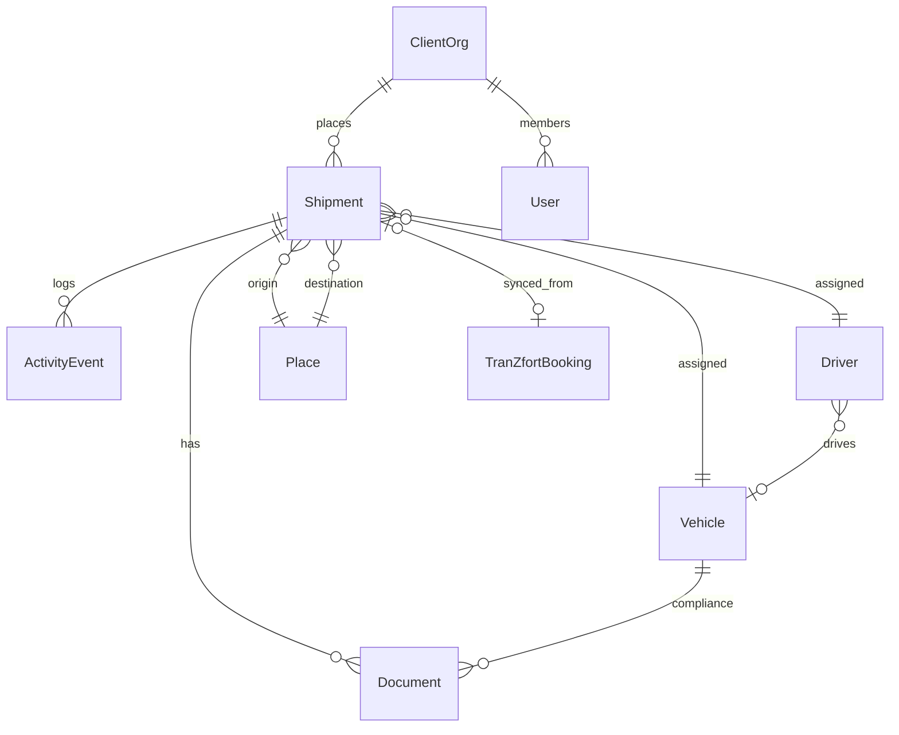

# Entity Relationships

| Parent | [domain-model.md](./domain-model.md) |

---

## ER diagram

---

## Cardinality notes

| Relationship | Rule |
|--------------|------|
| Shipment → Driver | 0..1 active assignment |
| Shipment → Vehicle | 0..1 active assignment |
| Driver → Vehicle | 0..1 current |
| Shipment → TranZfort booking | 0..1 |

---

## Document history

| Date | Change |
|------|--------|
| Jul 2026 | Initial ER diagram |
