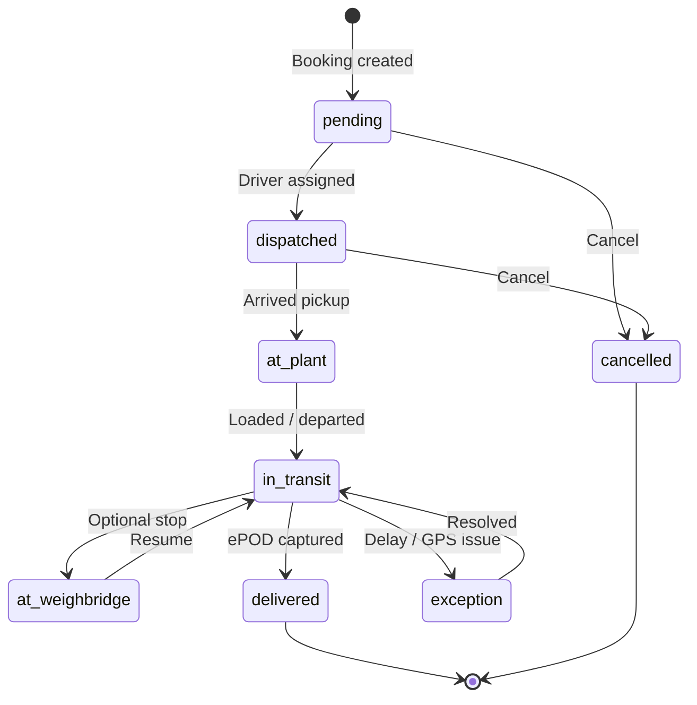

# Shipment Lifecycle

| Parent | [status-enumerations.md](./status-enumerations.md) |

---

## State diagram

---

## Transitions (who triggers)

| From | To | Trigger |
|------|-----|---------|
| pending | dispatched | Dispatcher assign |
| dispatched | at_plant | Driver app / geofence |
| at_plant | in_transit | Driver status update |
| in_transit | delivered | Driver ePOD upload |
| * | cancelled | Dispatcher / admin |
| * | exception | System rule |

---

## Customer-visible subset

pending → dispatched → in_transit → delivered (simplified on track page)

---

## Document history

| Date | Change |
|------|--------|
| Jul 2026 | Initial lifecycle |
