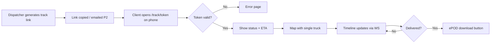

# Flow — Client Self-Serve Tracking

| Priority | P0 |

---

## Flowchart

---

## Actor

**Shipper** — no login required for MVP.

---

## Screens

- `/track/[token]` only
- See [public-tracking-page.md](../design/public-tracking-page.md)

---

## Document history

| Date | Change |
|------|--------|
| Jul 2026 | Initial client tracking flow |
