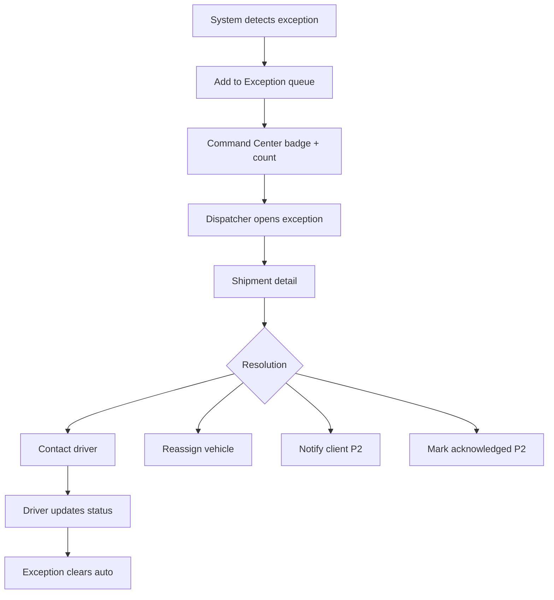

# Flow — Exception Handling

| Priority | P0 |

---

## Exception types (MVP)

| Type | Trigger | Detection |
|------|---------|-----------|
| `late_eta` | ETA slip > 30 min | BFF scheduler |
| `stale_gps` | No ping > 15 min on active trip | Realtime monitor |
| `missing_epod` | Delivered > 2h, no ePOD | Batch job |

---

## Flowchart

---

## UI surfaces

- Command Center exception queue (right panel)
- Shipments tab "Exceptions"
- Orange left border on shipment rows
- Notification bell count

---

## Document history

| Date | Change |
|------|--------|
| Jul 2026 | Initial exception flow |
