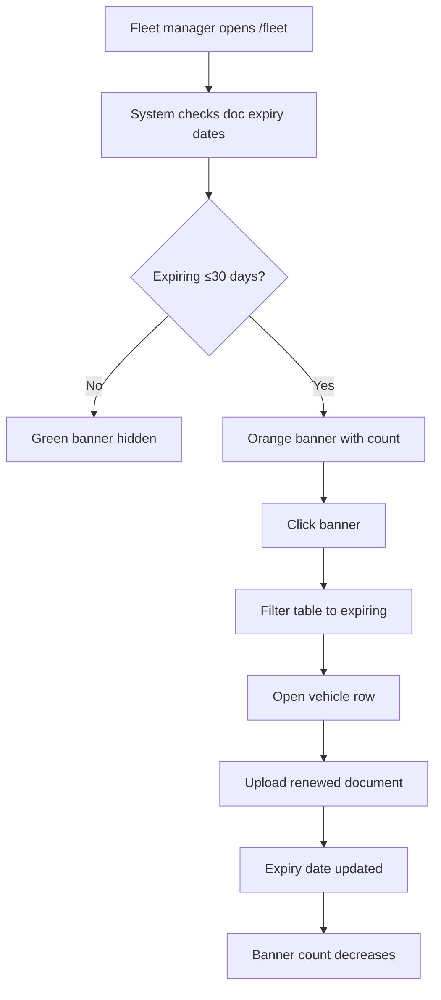

# Flow — Fleet Compliance Alerts

| Priority | P1 |

---

## Flowchart

---

## Alert surfaces

- Fleet page banner
- Vehicle row doc traffic light
- Command Center KPI (P2): "Compliance issues"

---

## Document history

| Date | Change |
|------|--------|
| Jul 2026 | Initial compliance flow |
