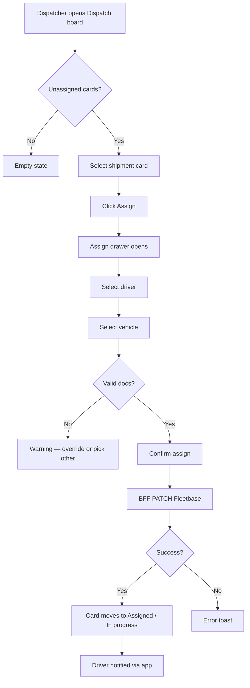

# Flow — Manual Dispatch

| Priority | P0 |

---

## Flowchart

---

## Screens touched

1. `/dispatch` — Kanban board
2. Assign drawer (overlay)
3. `/shipments/[id]` — optional verify

---

## Business rules

- Vehicle capacity ≥ shipment tonnage
- Driver license not expired
- Vehicle docs green or orange (red blocks unless admin override P2)

---

## Document history

| Date | Change |
|------|--------|
| Jul 2026 | Initial manual dispatch flow |
