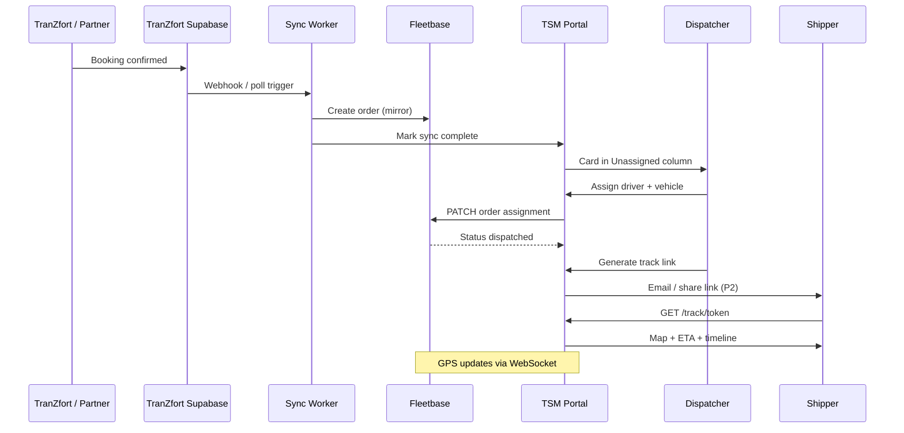

# Flow — North Star: TranZfort to Client Tracking

| Priority | P0 — MVP success criteria |
|----------|---------------------------|

---

## Sequence

---

## Steps

| Step | Actor | System | Success |
|------|-------|--------|---------|
| 1 | Partner | TranZfort | Booking exists |
| 2 | Sync | Worker | Order in Fleetbase < 2 min |
| 3 | Dispatcher | TSM | Sees unassigned card |
| 4 | Dispatcher | TSM | Assign completes |
| 5 | Dispatcher | TSM | Track link generated |
| 6 | Client | Track page | Live status visible |

---

## Failure modes

| Failure | UX |
|---------|-----|
| Sync delay | Orange banner on dispatch board |
| Assign fails | Toast + card stays unassigned |
| No GPS | Gray marker + exception queue |
| Invalid track token | Error page with support email |

---

## Related

- [tranzfort-sync-bridge.md](../integrations/tranzfort-sync-bridge.md)
- [mvp-scope.md](../product/mvp-scope.md)

---

## Document history

| Date | Change |
|------|--------|
| Jul 2026 | Initial north star flow |
