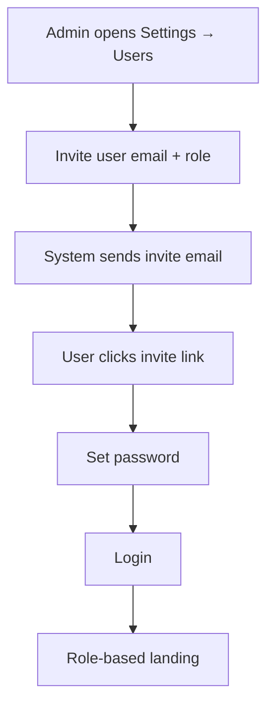

# Flow — User Onboarding

| Priority | P2 |

---

## Flowchart

---

## Roles invited

| Role | Typical invitee |
|------|-----------------|
| `dispatcher` | ZAFTYS ops |
| `fleet_manager` | Fleet office |
| `client` | Shipper contact at enterprise account |

---

## MVP workaround

Manual user seed in database until Settings UI ships.

---

## Document history

| Date | Change |
|------|--------|
| Jul 2026 | Initial onboarding flow |
