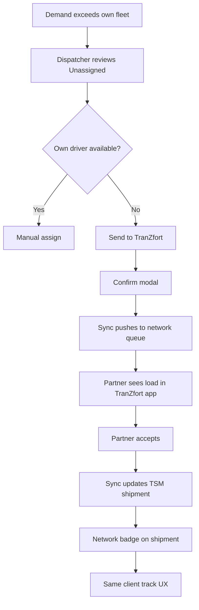

# Flow — TranZfort Overflow

| Priority | P1 — Phase 2 UI |

---

## Flowchart

---

## UI (P2)

- Dispatch card action: "Send to TranZfort"
- `/network/overflow` queue view
- Origin badge: Network

---

## Canonical product rules

Implement against [zaftys-tranzfort-load-exchange.md](../integrations/zaftys-tranzfort-load-exchange.md):

- ZAFTYS is always the TranZfort supplier; shipper never posts
- Verified-open partners in Phase 1; settlement always via ZAFTYS
- Keep `ShipmentStatus` unchanged; use `networkListing.state` for post/offers/assign
- Multi-truck + partial fill in Phase 1

---

## Document history

| Date | Change |
|------|--------|
| Jul 2026 | Initial overflow flow |
| Jul 2026 | Link to Load Exchange CPO spec |
