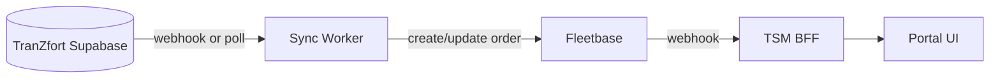

# TranZfort Sync Bridge

| Field | Value |
|-------|-------|
| **Systems** | TranZfort Supabase ↔ Fleetbase ↔ TSM BFF |

---

## Purpose

Mirror marketplace bookings into LOS execution layer so dispatchers see TranZfort loads in one portal.

---

## Architecture

---

## Triggers

| Phase | Trigger |
|-------|---------|
| P1 shadow | Poll every 60s or Supabase webhook on `trips` insert |
| P3 | Bidirectional webhooks |

---

## Sync rules

| Rule | Detail |
|------|--------|
| Idempotency | `tranzfort_id` in order.meta — upsert not duplicate |
| Conflict | Fleetbase wins on assignment; TranZfort wins on booking create |
| Failure retry | 3 retries exponential backoff; dead letter log |
| SLA target | < 2 min p95 booking → visible in dispatch |

---

## Events synced (P1)

| TranZfort event | Action |
|-----------------|--------|
| `trips.insert` | Create Fleetbase order |
| `trips.update status` | PATCH order status |
| `trips.cancel` | Cancel order |

---

## Monitoring

- Last sync timestamp on dispatch board
- Orange banner if sync > 5 min stale
- Runbook: [runbook-sync-failure.md](../ops/runbook-sync-failure.md)

---

## Document history

| Date | Change |
|------|--------|
| Jul 2026 | Initial sync bridge spec |
