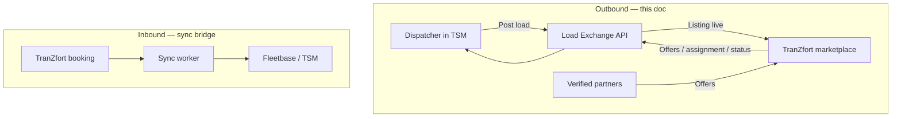
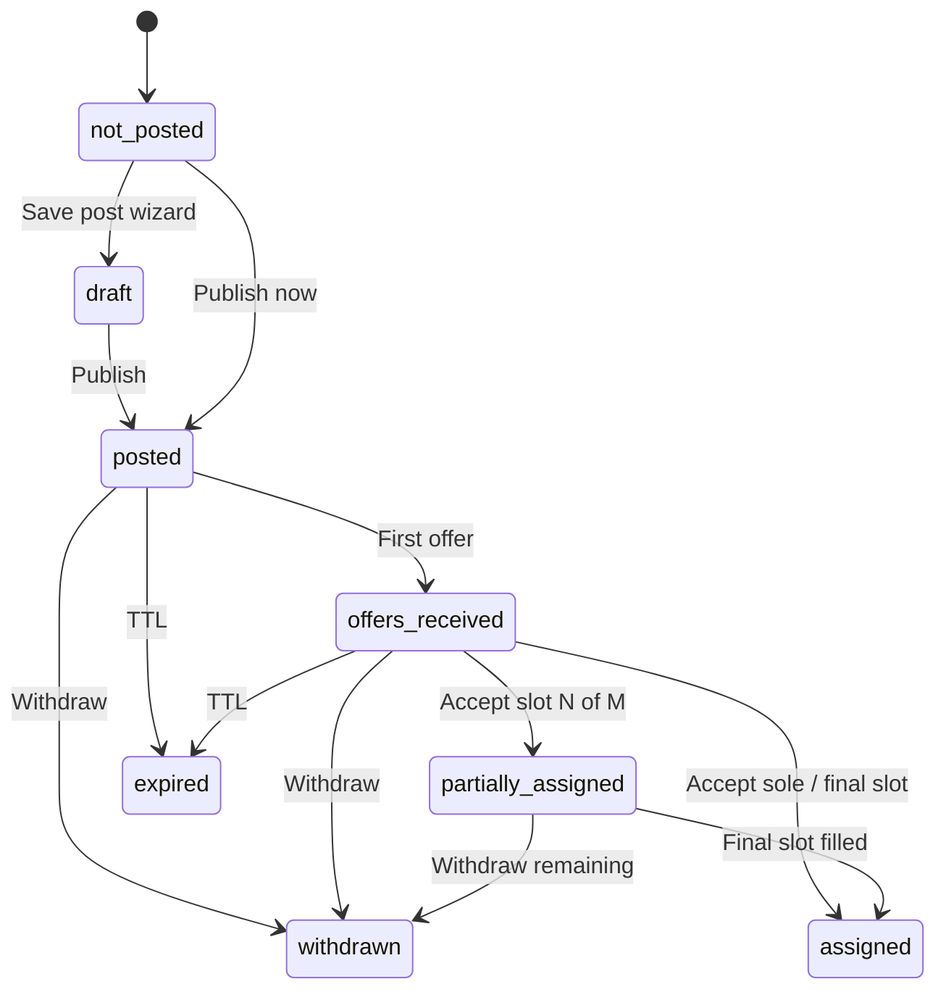
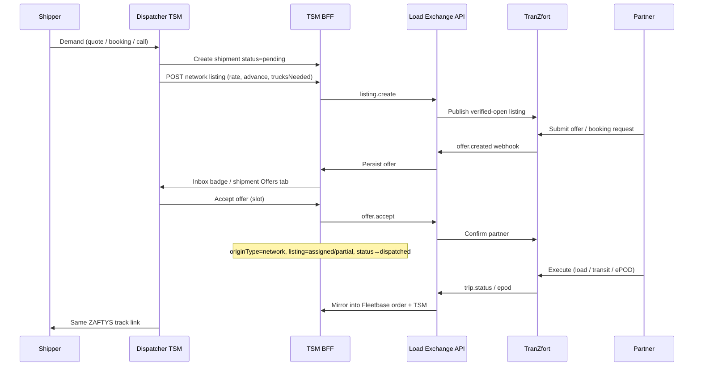

# ZAFTYS ↔ TranZfort Load Exchange

| Field | Value |
|-------|-------|
| **Status** | Accepted (CPO) |
| **Date** | Jul 2026 |
| **Owner** | Product (ZAFTYS TSM) |
| **Systems** | TSM Portal + BFF ↔ TranZfort Load Exchange API ↔ TranZfort mobile / Supabase |
| **Related ADR** | [ADR-006](../decisions/006-zaftys-tranzfort-commercial-model.md) |
| **Replaces / extends** | Outbound half of [tranzfort-sync-bridge.md](./tranzfort-sync-bridge.md); productizes [tranzfort-overflow.md](../flows/tranzfort-overflow.md) |

---

## 1. Purpose

Enable every ZAFTYS dispatcher to **post a load to TranZfort from inside ZAFTYS TSM**, receive partner offers, approve capacity, and keep execution + client tracking under ZAFTYS — without the shipper ever touching TranZfort.

This is the **outbound** network path (ZAFTYS → TranZfort). The existing sync bridge remains the **inbound** path (TranZfort bookings → TSM) for cases where demand originates on the marketplace.



---

## 2. CPO decisions (locked)

### D1 — ZAFTYS is always the “supplier” on TranZfort

| Decision | **Yes. Always.** |
|----------|------------------|
| **Rule** | On TranZfort, the listing organization is **ZAFTYS Logistics**. The industrial shipper is ZAFTYS’s client — never a TranZfort supplier account created from TSM. |
| **Why** | Protects brand, pricing, KYC, and settlement. Matches non-goal: no public broker board; no partner↔shipper commercial side-channel. |
| **UX implication** | Shipper portal / client role can request capacity and track; they **cannot** “Post to TranZfort.” Only `admin` / `dispatcher` (and later approved automation) can post. |
| **Data implication** | Listings carry `posted_by_org = zaftys`, `client_id` (ZAFTYS CRM client) as internal metadata — not exposed as the TranZfort supplier identity. |

### D2 — Visibility: verified-open first; preferred later

| Decision | **Phase 1 = verified-open spot overflow. Phase 2 = preferred / invite-only controls.** |
|----------|----------------------------------------------------------------------------------------|
| **Phase 1** | Any **KYC-verified** TranZfort partner can see and request ZAFTYS-posted loads (subject to vehicle/body match filters). |
| **Not Phase 1** | Anonymous / unverified public board (explicit product non-goal). |
| **Phase 2** | Preferred partner lists, invite-only posts, lane affinity boosts, auto-offer to shortlists. |
| **Why** | Overflow’s job is **liquidity under surge**. Invite-only first starves capacity. Quality is gated by verification, not by invite lists. Contract corridors get preferred controls once spot flow works. |

### D3 — Settlement: ZAFTYS always pays the partner

| Decision | **Yes. ZAFTYS always settles the partner.** |
|----------|-----------------------------------------------|
| **Commercial triangle** | Shipper ↔ **ZAFTYS** (receivable) · Partner ↔ **ZAFTYS** (payable) · Never shipper ↔ partner. |
| **Why** | Already in [non-goals.md](../product/non-goals.md). One commercial owner, one GST posture, one dispute desk. |
| **TSM implication** | Posted rate / accepted rate / shipper rate must be visible for margin; partner payout is a ZAFTYS payable linked to the shipment. |

### D4 — Status model: do not add `network_posted` to `ShipmentStatus`

| Decision | **Keep execution status clean. Add a separate network listing substate.** |
|----------|----------------------------------------------------------------------------|

**Do not** extend `ShipmentStatus` with `network_posted`. That mixes marketplace posting with physical lifecycle and breaks dispatch board columns, client track simplification, and Fleetbase mapping.

| Field | Values | Meaning |
|-------|--------|---------|
| `status` (`ShipmentStatus`) | `pending` → `dispatched` → … → `delivered` / `cancelled` / `exception` | Physical / ops lifecycle only ([shipment-lifecycle.md](../data/shipment-lifecycle.md)) |
| `originType` | `fleet` \| `network` \| `handoff` | **Capacity source once known** |
| `networkListing.state` | see below | Marketplace posting substate |

**`networkListing.state`**

| State | Meaning |
|-------|---------|
| `not_posted` | Default — no TranZfort listing |
| `draft` | Post wizard saved, not live |
| `posted` | Live on TranZfort, no offers yet |
| `offers_received` | ≥1 open partner offer |
| `partially_assigned` | Some truck slots filled, listing still open |
| `assigned` | All required slots filled (or single-truck accepted) |
| `withdrawn` | Dispatcher withdrew |
| `expired` | Listing TTL elapsed |

**Transition rules (CPO)**

1. While seeking network capacity: `status` stays **`pending`**; `networkListing.state` moves `draft` → `posted` → `offers_received`.
2. `originType` stays **`fleet`** until a partner is accepted (intent was own fleet / undecided). On first partner accept for the shipment’s capacity plan, set `originType = network`.
3. On partner accept + binding truck/driver: `networkListing.state` → `assigned` or `partially_assigned`; dispatcher/system moves `status` → **`dispatched`** when ready to execute (same as own-fleet assign).
4. Withdraw listing before any accept: `networkListing.state = withdrawn`; `status` remains `pending`; `originType` stays `fleet`.
5. Cancel shipment: cancel/withdraw listing on TranZfort; `status = cancelled`.



### D5 — API surface: Load Exchange contract; adapter hides Supabase

| Decision | **Proper TranZfort Integration (Load Exchange) API + webhooks is the product contract. Supabase service role is an implementation detail behind an adapter — not the public interface.** |
|----------|----------------------------------------------------------------------------------------------------------------------------------------------------------------------------------------|
| **Why** | Enterprise reliability, versioning, audit, multi-consumer safety. Today’s direct PostgREST in TSM is a spike, not a platform boundary. |
| **Phase 1** | Define OpenAPI events below; implement adapter that may call Supabase with service role **only inside the TranZfort/BFF integration layer**. |
| **Phase 2** | Webhooks required for offers, assignment, status (poll as fallback only). |
| **Forbidden** | Browser → Supabase; TSM UI knowing TranZfort table shapes; coupling shipment domain to PostgREST filters. |

### D6 — Multi-truck / partial fills: required early

| Decision | **Phase 1 must support `trucksNeeded` (1..N) and partial fill (accept k of N without closing the listing).** |
|----------|---------------------------------------------------------------------------------------------------------------|
| **Why** | Industrial FTL (cement, steel, mining) routinely needs 2–3 trucks on one demand. Deferring multi-truck forces dispatchers into ugly workarounds (N duplicate shipments). |
| **Phase 1 scope** | One listing, `trucksNeeded`, per-slot offers, `partially_assigned` until full or manually closed. |
| **Phase 1 out** | Complex split billing across slots beyond simple per-truck payable lines (keep payable line per accepted slot). |
| **Later** | Auto-split into child shipments per truck if Fleetbase/order model requires 1:1 vehicle — optional orchestration, not blocker for posting UX. |

---

## 3. Personas & permissions

| Actor | System | Can post load? | Can approve offer? | Settles money? |
|-------|--------|----------------|--------------------|----------------|
| Dispatcher / Admin | TSM | Yes | Yes | No (finance later) |
| Fleet manager | TSM | No (default) | No | No |
| Client (shipper) | TSM / track | **No** | No | Pays ZAFTYS |
| Network partner | TranZfort app | No (requests loads) | N/A (requests) | Paid by ZAFTYS |
| Automation | TSM policies | Yes (if policy on) | Optional auto-accept rules (Phase 2) | No |

RBAC alignment: [user-roles-rbac.md](../product/user-roles-rbac.md) — “Send to TranZfort” remains admin + dispatcher.

---

## 4. End-to-end flow (outbound north star)



**Client promise:** Shipper always sees ZAFTYS tracking. Network vs own fleet is an internal ops concern (optional internal badge only).

---

## 5. Domain objects

### 5.1 Shipment (TSM) — extensions

Existing shipment fields remain. Add:

| Field | Type | Notes |
|-------|------|-------|
| `networkListing.state` | enum | See D4 |
| `networkListing.id` | string \| null | TranZfort listing id |
| `networkListing.tranzfortTripIds` | string[] | One per accepted slot |
| `networkListing.trucksNeeded` | number | ≥ 1 |
| `networkListing.trucksFilled` | number | Accepted slots |
| `networkListing.postedAt` | ISO datetime | |
| `networkListing.expiresAt` | ISO datetime \| null | |
| `networkListing.visibility` | `verified_open` \| `invite_only` | Phase 1 = `verified_open` only |
| `networkListing.rate` | money + `fixed` \| `per_ton` | Offer rate to network |
| `networkListing.advancePercent` | 0–50 | Matches TranZfort supplier UX |
| `tranzfortId` | string \| null | **Deprecated for multi-truck** — prefer `tranzfortTripIds[0]` for back-compat |

### 5.2 Network listing (TranZfort)

Canonical marketplace object created by ZAFTYS:

- Route, commodity, tonnage (total or per truck), body/tyres, pickup window
- `trucksNeeded`, price, advance, notes, docs refs
- `external_ref = zaftys_shipment_id` (idempotency)

### 5.3 Offer (booking request)

Partner → listing:

- Partner id, vehicle, driver (optional until accept), rate (if counter), submitted at, KYC flags

### 5.4 Slot assignment

On accept:

- Bind partner + vehicle (+ driver) to slot index
- Create/update Fleetbase order leg or child assignment
- Push payable line (ZAFTYS → partner)

---

## 6. Load Exchange API (contract)

Versioned under TranZfort Integration, consumed only by TSM BFF (and sync worker).

### 6.1 Commands (TSM → TranZfort)

| Command | Purpose |
|---------|---------|
| `listing.create` | Publish from shipment (idempotent on `zaftys_shipment_id`) |
| `listing.update` | Rate, window, trucksNeeded, notes while not fully assigned |
| `listing.withdraw` | Soft-close; reject open offers |
| `offer.accept` | Accept offer for slot `k` |
| `offer.reject` | Reject with reason |
| `offer.counter` | Phase 2 — counter rate |

### 6.2 Events (TranZfort → TSM)

| Event | Purpose | Delivery |
|-------|---------|----------|
| `listing.published` | Ack + listing id | Sync response + webhook |
| `offer.created` | New partner request | **Webhook** (Phase 2; poll OK in Phase 1) |
| `offer.withdrawn` | Partner cancelled request | Webhook |
| `slot.assigned` | Confirm accept | Webhook |
| `trip.status_changed` | Execution status | Webhook |
| `trip.epod_uploaded` | Proof | Webhook |
| `listing.expired` | TTL | Webhook |

### 6.3 Idempotency & conflicts

| Rule | Detail |
|------|--------|
| Create listing | Upsert by `zaftys_shipment_id` — never duplicate live listings |
| Accept offer | Idempotent on `offer_id`; slot cannot double-book |
| Conflict — commercial fields while `posted` | **TSM wins** |
| Conflict — execution after assign | **TranZfort / partner mobile wins** for status & ePOD |
| Conflict — ZAFTYS force cancel | Allowed with reason; notifies partner; payable rules per finance policy |
| SLA | Listing visible to partners & offers visible in TSM **&lt; 2 min p95** |

### 6.4 Adapter note (implementation)

```
TSM BFF  →  TranZfortClient (interface)
                ├─ Phase 1: Supabase service-role adapter
                └─ Phase 2+: HTTPS Load Exchange + signed webhooks
```

Existing `tranzfort-client.ts` (fetch trips + status PATCH) becomes one adapter behind this interface — do not grow raw PostgREST calls across the codebase.

---

## 7. TSM product surfaces

| Surface | Behavior |
|---------|----------|
| Shipment detail | **Post to TranZfort** wizard; Offers tab; listing state chip |
| Dispatch card | Post / offers count / withdraw; Network badge when `originType=network` |
| `/network/overflow` | **Outbound desk**: ZAFTYS-posted listings + open offers (primary). Inbound TZ→ZAFTYS queue remains secondary/tabbed. |
| `/network/partners` | Verified partners; Phase 2 preferred lists |
| `/network/sync` | Outbound + inbound health, last event, retry |
| Command Center | Open posts aging, offers waiting &gt; N hours |
| Settings → policies | Auto-suggest overflow, notify on first offer, listing TTL, min rate floor (Phase 2) |
| Client track | Unchanged simplified lifecycle; no marketplace chrome |

Replace demo-only `createOverflowFromShipment` local queue with live listing create via Load Exchange (keep demo mode when `TSM_DEMO_UI=1`).

---

## 8. Post wizard (dispatcher UX)

Prefilled from shipment; editable before publish:

1. Route & commodity & total tonnage  
2. `trucksNeeded` (default 1)  
3. Body type / tyres filters  
4. Pickup window / plant notes  
5. Price type (`fixed` \| `per_ton`) + rate  
6. Advance % (0–50)  
7. Visibility: Phase 1 fixed to **Verified network** (copy — not “public load board”)  
8. Docs attach (optional)  
9. Confirm → `listing.create`

Reference UX: marketing `PostLoadDemo` (route → price/advance → requests → approve).

---

## 9. Phased delivery

### Phase 1 — Live post + multi-slot offers (P0)

- [ ] Load Exchange interface + Supabase adapter  
- [ ] `listing.create` / `update` / `withdraw` from shipment + dispatch  
- [ ] Persist `networkListing.*` on shipment  
- [ ] Offer list in TSM (poll acceptable)  
- [ ] Accept / reject per slot; `partially_assigned`  
- [ ] Set `originType=network` on accept; status → `dispatched` when bound  
- [ ] Status push continues for linked trip ids  
- [ ] Demo mode keeps in-memory overflow for UI without credentials  

### Phase 2 — Webhooks + preference controls

- [ ] Signed webhooks for offers / status / ePOD  
- [ ] Preferred partners + invite-only visibility  
- [ ] Counter-offer  
- [ ] Auto-accept rules  
- [ ] Margin + payable lines in billing  

### Phase 3 — Hardening

- [ ] Child shipments per truck (if needed)  
- [ ] Dispute / detention flags  
- [ ] SLA dashboards, audit export  
- [ ] Retire dual “inbound overflow” confusion in IA copy  

---

## 10. Success metrics

| Metric | Target |
|--------|--------|
| Time post → first offer | p50 &lt; 30 min on active lanes |
| Time post → visible on TranZfort | p95 &lt; 2 min |
| Dispatcher posts without leaving TSM | 100% of network overflow |
| Duplicate listings per shipment | 0 |
| Shipper contacts partner directly for settlement | 0 (process breach) |
| Multi-truck posts using `trucksNeeded` &gt; 1 | Track adoption weekly |

---

## 11. Non-goals (this program)

- Shipper self-serve posting to TranZfort from TSM  
- Anonymous / unverified public load board  
- Partner billing the shipper  
- Replacing TranZfort mobile for partner execution  
- Merging TranZfort and TSM into one app  

---

## 12. Doc map

| Doc | Relationship |
|-----|--------------|
| [tranzfort-sync-bridge.md](./tranzfort-sync-bridge.md) | Inbound + status mirror; this doc owns outbound listing/offers |
| [tranzfort-overflow.md](../flows/tranzfort-overflow.md) | UI flow sketch — implement per this spec |
| [north-star-tranzfort-to-tracking.md](../flows/north-star-tranzfort-to-tracking.md) | Inbound north star; outbound complement is §4 here |
| [non-goals.md](../product/non-goals.md) | Commercial + marketplace boundaries |
| [shipment-lifecycle.md](../data/shipment-lifecycle.md) | Execution statuses unchanged |
| [ADR-006](../decisions/006-zaftys-tranzfort-commercial-model.md) | Decision record for D1–D6 |

---

## Document history

| Date | Change |
|------|--------|
| Jul 2026 | CPO decisions locked; Load Exchange spec created |
