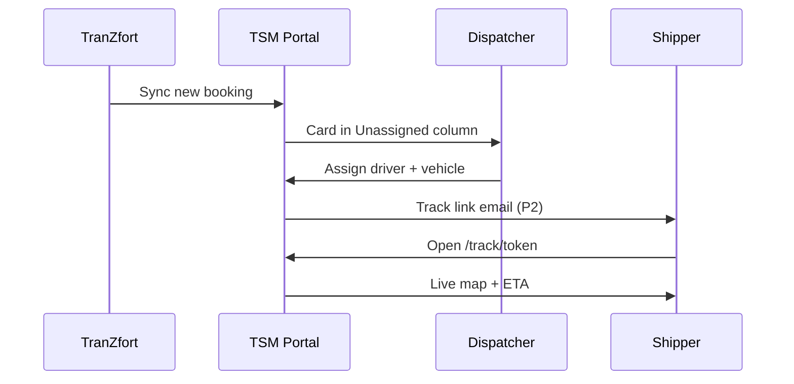
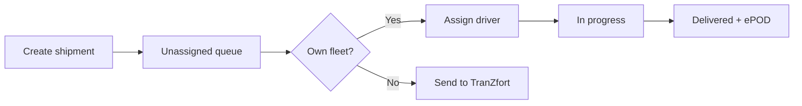
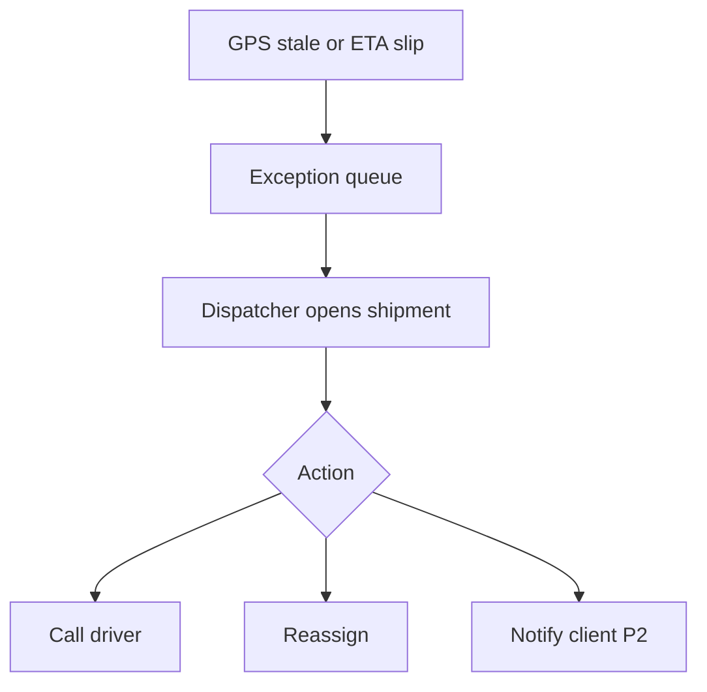

# ZAFTYS TSM — UI/UX Features Specification

| Field | Value |
|-------|-------|
| **Status** | Canonical UI/UX spec (Jul 2026) |
| **Portal** | `https://app.zaftys.com` |
| **Stack (target)** | Next.js · shadcn/ui · Tailwind · ZAFTYS design tokens |
| **Parent doc** | [app-overview.md](./app-overview.md) |

---

## Purpose

This document defines **what users see and do** in ZAFTYS TSM: layout, screens, components, interactions, role differences, and responsive behavior. It is the handoff spec for design and front-end implementation.

**Scope tiers**

| Tier | Screens | When |
|------|---------|------|
| **MVP (P2)** | 8 core screens | First shippable portal |
| **Phase 2** | +12 operational screens | Billing, reports, network depth |
| **Phase 3+** | Full IA (~40+ routes) | Multi-tenant SaaS, AI widgets |

---

## UX principles

1. **Ops-first clarity** — Dispatchers scan status in seconds; dense data is OK if hierarchy is clear.
2. **One map, many views** — Same live map component in Command Center, Live Map, Shipment detail, Client tracking (scoped).
3. **Industrial language** — Shipment, trip, LR, plant window, weighbridge — not generic "order/delivery."
4. **Own fleet + network visible** — Visual distinction between ZAFTYS assets and TranZfort partner trips everywhere.
5. **Mobile for field, desktop for dispatch** — Tablet-friendly dispatch board; phone-first client tracking.
6. **Fail gracefully** — Stale GPS, sync delay, missing ePOD show actionable states, not blank screens.
7. **Brand continuity** — Portal feels like `zaftys.com`: navy shell, orange actions, same typography.

---

## User roles & default landing

| Role | Landing after login | Nav visibility |
|------|---------------------|----------------|
| **Dispatcher / Ops** | Command Center | Full ops nav |
| **Fleet manager** | Fleet → Vehicles | Fleet, Shipments (read), Documents |
| **Shipper / Client** | Shipments (filtered: my org) | Shipments, Documents, Reports (P2) |
| **Network partner** | Network → Assignments | Network, limited Shipments |
| **Admin** | Command Center | All + Settings, Users, Reports |

---

## Information architecture & routes

### MVP routes (P2)

| Route | Screen | Auth |
|-------|--------|------|
| `/login` | Login | Public |
| `/` | Command Center | Ops, Admin |
| `/shipments` | Shipments list | All authenticated |
| `/shipments/[id]` | Shipment detail | All (scoped by role) |
| `/dispatch` | Dispatch board | Ops, Admin |
| `/map` | Live map (fullscreen) | Ops, Admin |
| `/fleet` | Fleet (vehicles + drivers) | Ops, Fleet, Admin |
| `/track/[token]` | Client tracking | Public (tokenized) |

### Phase 2 routes (add after MVP)

| Route | Screen |
|-------|--------|
| `/network/overflow` | TranZfort overflow queue |
| `/network/assignments` | Partner assignments |
| `/clients` | Shipper accounts |
| `/documents` | Global document library |
| `/reports` | Analytics hub |
| `/reports/lanes` | Lane performance |
| `/settings` | Org settings |
| `/settings/users` | User & role management |
| `/shipments/new` | Create shipment wizard |
| `/fleet/vehicles/[id]` | Vehicle detail + docs |
| `/fleet/drivers/[id]` | Driver detail |
| `/notifications` | Alert inbox |

---

## App shell (global layout)

### Desktop (≥1024px)

```
┌──────────────────────────────────────────────────────────────┐
│ Top bar: logo · global search · alerts bell · user menu      │
├────────────┬─────────────────────────────────────────────────┤
│            │ Page header: title · breadcrumbs · primary CTA  │
│  Sidebar   ├─────────────────────────────────────────────────┤
│  (navy)    │                                                 │
│            │  Main content area                              │
│  · Command │                                                 │
│  · Shipmnt │                                                 │
│  · Dispatch│                                                 │
│  · Live Map│                                                 │
│  · Fleet   │                                                 │
│  · Network │                                                 │
│  · …       │                                                 │
│            │                                                 │
│  Collapse  │                                                 │
└────────────┴─────────────────────────────────────────────────┘
```

**Sidebar**
- Background: navy (`--primary`)
- Active item: orange left border + lighter navy fill
- Icons: Lucide, 20px, white/muted
- Collapsible to icon-only (64px) — persist preference in localStorage
- Footer: "ZAFTYS TSM™" + link to `zaftys.com` support

**Top bar**
- Global search: shipment ID, LR number, vehicle reg, client name (debounced, ⌘K shortcut)
- Notifications bell: exception count badge (orange)
- User menu: profile, role badge, logout

**Page header**
- Title: `font-heading`, sentence case ("Command Center" not "COMMAND CENTER" in H1)
- Breadcrumbs on detail pages
- Primary CTA right-aligned (e.g. "Create shipment", "Assign driver")

### Tablet (768–1023px)

- Sidebar collapses to hamburger overlay
- Dispatch board: horizontal scroll for columns
- Map: 50% height stack above detail panel

### Mobile (<768px)

- Bottom tab bar for **Client** role only: Track · Documents · Account
- Ops roles: recommend tablet minimum; show banner "Use desktop for dispatch"
- Public tracking: fully mobile-optimized

---

## Design system (portal application)

Port tokens from `zaftys.com` `src/index.css`. Do not invent a second palette.

| Element | Spec |
|---------|------|
| **Page background** | `bg-background` (white) |
| **Cards** | White, `shadow-soft`, `rounded-lg`, border `border-border` |
| **Primary button** | Orange accent (`variant="accent"` equivalent) |
| **Secondary button** | Navy outline |
| **Headings** | `font-heading`, navy text |
| **Body** | Sans, `text-muted-foreground` for secondary |
| **Data tables** | Zebra optional; sticky header on scroll |

### Status color system

| Status | Color | Badge label |
|--------|-------|-------------|
| Booked / Pending dispatch | Steel gray | Pending |
| Dispatched | Cyan | Dispatched |
| At plant / loading | Yellow | At plant |
| In transit | Primary navy | In transit |
| At weighbridge | Yellow | Weighbridge |
| Delivered | Green | Delivered |
| Exception / Delayed | Orange | Exception |
| Cancelled | Red muted | Cancelled |

### Asset origin badges

| Origin | Badge |
|--------|-------|
| Own fleet | Navy pill: "ZAFTYS Fleet" |
| TranZfort network | Orange outline: "Network" |
| Mixed / handoff | Split icon + "Handoff" |

---

## Global UI patterns

### Data table (Shipments, Fleet lists)

- Columns: configurable per screen; MVP fixed set
- Row click → detail; checkbox bulk select (Phase 2)
- Inline status chip in status column
- Sort: created date, ETA, status (default: active first)
- Filters: drawer from right (mobile: full-screen sheet)
- Pagination: 25 / 50 / 100; show total count
- Empty state: illustration + CTA ("Create first shipment" / "No active trips")

### Filter drawer

- Status multi-select
- Date range (pickup / delivery)
- Origin / destination corridor
- Fleet vs Network toggle
- Client org (ops only)
- Apply + Clear buttons sticky at bottom

### Shipment timeline (vertical)

Used on Shipment detail and Client tracking.

```
● Booked          12 Jul, 08:00   Amravati plant
● Dispatched      12 Jul, 09:15   Driver: R. Sharma · MH-27-AB-1234
● Loaded          12 Jul, 10:30   32 MT cement
◉ In transit      —               Last ping: 2 min ago
○ Delivered       ETA 14:00       Nagpur
```

- Completed steps: green dot + timestamp
- Current step: orange pulsing dot
- Future steps: hollow gray
- Tap step → scroll map to that geofence (if available)

### Map component (shared)

**Provider:** Mapbox or Google Maps (decide in P0; prefer Mapbox for styling control)

| Layer | Behavior |
|-------|----------|
| Vehicle markers | Truck icon; orange = moving, gray = idle |
| Route polyline | Navy dashed line; solid when active trip |
| Pickup / drop pins | Green pickup, red drop |
| Geofences | Subtle circle: plant, weighbridge |
| Cluster | Zoom in on cluster click |
| Popup | Vehicle reg, driver, speed, last update, "View shipment" link |

**Controls:** zoom, recenter, layer toggle (traffic off by default), fullscreen

**Stale GPS:** marker gray + tooltip "Location stale · last seen 45m ago"

### Modals & drawers

| Pattern | Use |
|---------|-----|
| **Drawer (right)** | Assign driver, filters, doc upload |
| **Modal (center)** | Confirm cancel, delete doc |
| **Sheet (bottom, mobile)** | Quick actions on shipment row |

### Toasts & alerts

- Success: green, auto-dismiss 4s
- Error: red, persist until dismissed
- Sync warning: orange, "TranZfort sync delayed · retrying"

### Loading skeletons

- Table: 5 shimmer rows
- Map: gray placeholder + spinner center
- KPI cards: pulse rectangles

---

## MVP screen specifications

### 1. Login (`/login`)

**Layout:** Split screen — left navy panel (logo, tagline, industrial image); right form.

| Element | UX |
|---------|-----|
| Logo | ZAFTYS header logo, links to `zaftys.com` |
| Tagline | "Operations become easier when everyone sees the same information." |
| Email + password | Standard; show/hide password |
| Remember me | Checkbox |
| Forgot password | Link → email flow (P2) |
| Submit | Orange full-width "Sign in to TSM" |
| Footer | GST-compliant ops note; support `info@zaftys.com` |

**Post-login:** redirect by role (see table above).

**Errors:** inline under field; lockout message after N failures (P2).

---

### 2. Command Center (`/`)

**Purpose:** Morning standup screen for ops — what's moving, what's broken.

**Layout:** 3-row grid.

**Row 1 — KPI cards (4 across)**

| Card | Metric | Click |
|------|--------|-------|
| Active trips | Count | → `/shipments?status=active` |
| Delayed / exceptions | Count (orange if >0) | → `/shipments?status=exception` |
| At plant / loading | Count | → filtered list |
| Network overflow | TranZfort unassigned | → `/network/overflow` (P2) or dispatch |

**Row 2 — Split 60/40**

| Left (60%) | Right (40%) |
|------------|-------------|
| **Live mini map** — all active vehicles | **Exception queue** — scrollable list max 8 items |

Exception row: shipment ID, reason (late ETA, no GPS, missing ePOD), quick "Open" link.

**Row 3 — Recent activity feed**

- Last 20 events: status changes, assignments, ePOD uploads
- Format: time · actor · action · shipment link

**Refresh:** WebSocket push; manual refresh icon; "Updated 30s ago" label.

---

### 3. Shipments list (`/shipments`)

**Purpose:** Single pane of glass for all trips.

**Header:** "Shipments" · Filter button · Search · "Create shipment" (ops, P2 wizard; MVP link to dispatch)

**Tabs:** All · Active · Completed · Exceptions

**Table columns (MVP)**

| Column | Notes |
|--------|-------|
| Shipment ID | Monospace, copy button |
| Client | Shipper name |
| Route | Origin → Destination (truncate middle) |
| Status | Chip |
| Origin badge | Fleet / Network |
| Driver / Vehicle | Or "Unassigned" in muted |
| ETA | Relative + absolute on hover |
| Actions | ⋮ menu: View, Assign, Track link |

**Row states:** Unassigned rows subtle orange left border.

**Bulk (P2):** assign, export CSV.

---

### 4. Shipment detail (`/shipments/[id]`)

**Purpose:** Single shipment command — timeline, map, people, docs.

**Layout:** 2-column desktop; tabs on mobile.

**Header**
- Shipment ID + status chip + origin badge
- Actions: Assign driver · Send track link · More (cancel, duplicate P2)

**Left column (55%)**

1. **Timeline** (see global pattern)
2. **Trip facts card** — commodity, tonnage, axle, LR #, plant window, special instructions
3. **Parties** — consignor, consignee, client contact, billing ref

**Right column (45%)**

1. **Map** — route + live marker if in transit
2. **Assignment card** — driver photo/initials, phone (click-to-call), vehicle reg, fleet badge
3. **Documents** — LR, ePOD thumbnails, invoice; upload button (ops)

**Tabs (mobile):** Overview · Map · Docs

**Client role:** hide Assign; show Download all docs; read-only timeline.

---

### 5. Dispatch board (`/dispatch`)

**Purpose:** Assign drivers and vehicles; handle overflow to TranZfort.

**Layout:** Kanban-style columns (horizontal scroll on tablet).

| Column | Contents |
|--------|----------|
| **Unassigned** | Cards from bookings + TranZfort sync |
| **Assigned** | Driver named, not yet departed |
| **In progress** | Active trips |
| **Completed today** | Collapsed by default |

**Shipment card (drag target P2; click-to-assign MVP)**

```
┌─────────────────────────┐
│ ZFT-2026-0142    [Net]  │
│ Amravati → Nagpur       │
│ Cement · 32 MT          │
│ Pickup: Today 14:00     │
│ [Assign]                │
└─────────────────────────┘
```

**Assign flow (drawer)**
1. Select driver (searchable dropdown, availability dot)
2. Select vehicle (filtered by capacity + docs valid)
3. Optional note to driver
4. Confirm → toast + card moves column

**Overflow action:** "Send to TranZfort" → confirm modal → pushes to network queue (P1 sync).

**Empty Unassigned:** "All caught up" + link to create shipment.

---

### 6. Fleet (`/fleet`)

**Purpose:** Registry of vehicles and drivers.

**Tabs:** Vehicles · Drivers · Documents (compliance overview P2)

**Vehicles table**

| Column | Notes |
|--------|-------|
| Registration | MH-XX-XX-XXXX |
| Type | Multi-axle, trailer, etc. |
| Capacity | MT |
| Assigned driver | Link |
| Status | Available / On trip / Maintenance |
| Docs | Traffic-light: green all valid, orange expiring, red expired |
| Actions | View · Edit (P2) |

**Drivers table**

| Column | Notes |
|--------|-------|
| Name | |
| Phone | |
| License # | Expiry chip |
| Current vehicle | |
| Status | On duty / Off / On trip |
| Actions | View · Assign to vehicle |

**Doc expiry alerts (banner):** "3 vehicles have documents expiring within 30 days" → filter.

---

### 7. Live map (`/map`)

**Purpose:** Fullscreen operational map for dispatch floor monitor or focused ops.

**Layout:** Map 100% viewport minus slim top toolbar.

**Toolbar**
- Filter chips: All · Own fleet · Network · Delayed only
- Search vehicle / shipment
- Legend toggle
- Open in new window (for wall display)

**Side panel (collapsible, 320px)**
- Click marker → shipment summary + "Open detail" button
- List mode toggle: sort vehicles by last update

**Keyboard:** `/` focus search, `Esc` close panel.

---

### 8. Client tracking (`/track/[token]`)

**Purpose:** Public, branded tracking for shippers — no login.

**Layout:** Mobile-first single column.

**Header:** ZAFTYS logo · "Track your shipment"

**Hero status**
- Large status chip
- Plain language: "Your shipment is in transit to Nagpur"
- ETA: "Expected today by 2:00 PM"

**Map:** simplified — route + truck marker only (no other fleet visible)

**Timeline:** subset of ops timeline (customer-safe events only)

**Documents (post-delivery):** Download ePOD button when available

**Footer:** Powered by ZAFTYS TSM™ · `info@zaftys.com` · link to `zaftys.com`

**Security:** token expires 90 days post-delivery; rate limit; no PII beyond consignee city.

---

## Phase 2 screen highlights

### Create shipment wizard (`/shipments/new`)

Steps: Client → Route → Load details → Schedule → Review

- Autocomplete places (Indian cities + plant names)
- Commodity presets: cement, steel, chemicals, FMCG
- Axle / vehicle type suggestion from tonnage

### Network overflow (`/network/overflow`)

- Queue of TranZfort bookings awaiting ZAFTYS assignment
- Match score column (P3): distance, partner rating
- Actions: Assign internal · Push to partner · Reject with reason

### Reports (`/reports`)

- Date range picker global
- Cards: on-time %, avg transit, utilization, exceptions by reason
- Lane table: origin-dest pair, trip count, avg delay
- Export PDF / CSV

### Settings (`/settings`)

- Org profile, GSTIN, corridors
- Notification preferences
- Integration status: TranZfort sync, Fleetbase health

---

## Component inventory

Reusable across screens — build once in `@/components/app/`.

| Component | Description |
|-----------|-------------|
| `AppShell` | Sidebar + top bar + content slot |
| `PageHeader` | Title, breadcrumbs, actions |
| `KpiCard` | Metric, delta, link |
| `ShipmentStatusChip` | Colored status badge |
| `OriginBadge` | Fleet / Network |
| `ShipmentsTable` | Sortable table with filters |
| `ShipmentCard` | Kanban card for dispatch |
| `Timeline` | Vertical shipment timeline |
| `LiveMap` | Shared map with layers |
| `AssignDriverDrawer` | Assignment form |
| `DocumentGallery` | Thumbnails + upload |
| `FilterDrawer` | Shared filter panel |
| `EmptyState` | Icon + title + CTA |
| `GlobalSearch` | ⌘K command palette |
| `NotificationBell` | Exception inbox dropdown |
| `StaleGpsWarning` | Inline alert banner |

---

## Key user flows

### Flow A — TranZfort booking to client tracking (north star)



### Flow B — Manual dispatch



### Flow C — Exception handling



---

## Responsive & device matrix

| Screen | Desktop | Tablet | Mobile |
|--------|---------|--------|--------|
| Command Center | Full grid | 2-col KPI, stacked map | KPI only + link to map |
| Shipments table | Full columns | Hide ETA column | Card list view |
| Dispatch board | 4 columns | Horizontal scroll | Not supported (banner) |
| Live map | Full + side panel | Full + bottom sheet | Client tracking only |
| Shipment detail | 2-column | Stacked | Tabs |
| Client tracking | Centered max-w-lg | Same | Primary target |

---

## Accessibility (WCAG 2.1 AA target)

- Color contrast: status chips meet 4.5:1; do not rely on color alone (icons + text)
- Keyboard: all actions reachable; focus rings visible on navy sidebar
- Screen reader: live region for map ETA updates; table row announcements
- Motion: respect `prefers-reduced-motion` for pulsing dots
- Form labels: explicit; error text linked via `aria-describedby`

---

## Microcopy & terminology

| Use | Avoid |
|-----|-------|
| Shipment | Order |
| Trip | Delivery job |
| LR (Lorry Receipt) | BOL |
| Plant window | Time slot |
| Own fleet | Internal order |
| Network trip | External order |
| ePOD | POD photo |
| Exception | Alert (too generic) |

**Empty state examples**
- Unassigned: "No shipments waiting — good work."
- No GPS: "Location unavailable — driver may be offline."
- Sync delay: "Network data is catching up — last sync 3 min ago."

---

## Notifications (UI surfaces)

| Trigger | Surface | MVP |
|---------|---------|-----|
| New TranZfort booking | Bell + dispatch column | ✅ |
| ETA slip > 30 min | Exception queue | ✅ |
| GPS stale > 15 min | Map warning + exception | ✅ |
| Doc expiring 30 days | Fleet banner | ✅ |
| ePOD uploaded | Activity feed | ✅ |
| Delivery complete | Client track page update | ✅ |
| WhatsApp to client | — | P4 |

---

## Open UX decisions

| # | Question | Recommendation |
|---|----------|----------------|
| 1 | Map provider | Mapbox (styling + cost predictability) |
| 2 | Dispatch drag-and-drop | MVP: click Assign; P2: drag cards |
| 3 | Dark mode | Phase 2 (dispatch floor night shift) |
| 4 | Hindi UI | Phase 3 (driver-facing first) |
| 5 | Command Center TV mode | `/map?kiosk=1` chromeless — P2 |
| 6 | Client login vs token-only | MVP token-only; client login P2 |

---

## Implementation checklist (design → dev)

### MVP

- [ ] App shell + role-based nav
- [ ] Design tokens package shared with marketing site
- [ ] Login + auth redirect
- [ ] Command Center KPI + mini map + exceptions
- [ ] Shipments list + detail + timeline
- [ ] Dispatch board + assign drawer
- [ ] Fleet vehicles + drivers tables
- [ ] Live map fullscreen
- [ ] Public client tracking page
- [ ] Shared StatusChip, OriginBadge, LiveMap, Timeline
- [ ] WebSocket hook for live updates
- [ ] Empty / loading / error states on all screens

### Phase 2

- [ ] Create shipment wizard
- [ ] Network overflow UI
- [ ] Reports dashboard
- [ ] Settings + users
- [ ] Global search ⌘K
- [ ] Notification inbox page
- [ ] Dark mode

---

## Related docs

| Doc | Path |
|-----|------|
| App product overview | [app-overview.md](./app-overview.md) |
| Marketing design tokens | `src/index.css` |
| Technology page (capabilities) | `src/pages/Technology.tsx` |
| Product vision | [../marketing/project-idea.md](../marketing/project-idea.md) |

---

## Document history

| Date | Change |
|------|--------|
| Jul 2026 | Initial UI/UX features spec for TSM MVP + Phase 2 |
